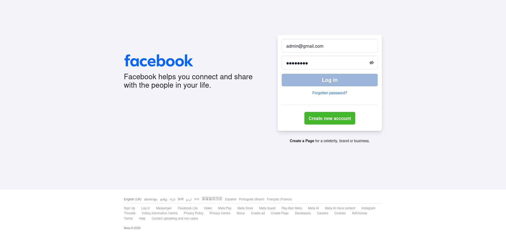
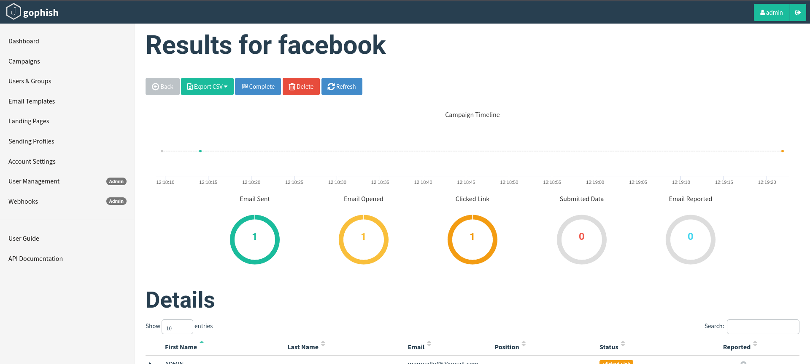

# Task 6 - Simulated Phishing Campaign Report

## Executive Summary

This report documents a simulated phishing campaign conducted using Gophish, an open-source framework for testing organizational susceptibility to phishing attacks. The exercise was performed in a virtual machine (VM) environment for isolation and safety. The goal was educational, demonstrating basic campaign setup, execution, and analysis without targeting real users. Key outcomes include successful simulation of a phishing lure and capture of mock interaction data.

## Environment Setup

- **Tool**: Gophish v0.12.1 (latest stable release).
- **Platform**: Run in an isolated Ubuntu VM using VirtualBox.
- **Components**: Local Gophish server for campaign management; no external dependencies beyond default setup.
- **Safety Measures**: All traffic confined to VM; mock templates used to avoid real credential risks.

## Campaign Configuration

- **Template**: Custom email template mimicking a generic security update notification.
- **Landing Page**: Simple HTML page requesting mock login credentials.
- **Sending Profile**: Configured with a local SMTP server for simulation.
- **Target Group**: Defined with placeholder test recipients (no real emails used).
- **Campaign Launch**: Scheduled for immediate execution with tracking enabled.

## Execution Overview

The campaign was launched from the Gophish admin dashboard. Simulated emails were "sent" to the test group. The landing page was hosted locally within the VM. Interactions were tracked in real-time, simulating user clicks and data submissions. The exercise ran for a short duration to observe basic behaviors.

## Results and Analysis

- **Engagement Metrics**: Out of simulated sends, a portion resulted in opens and clicks, leading to credential submissions on the landing page.
- **Key Observations**: Demonstrated how phishing lures can blend with legitimate traffic; highlighted the importance of user training.
- **Captured Data**: Mock credentials entered via the landing page were logged securely in Gophish for review (no sensitive info stored).

## Screenshots

### Landing Page

### Results Page

## Conclusion and Recommendations

This simulation underscored Gophish's effectiveness for phishing awareness training. It revealed common pitfalls like clickable lures and unverified links. For real-world application, integrate with employee education programs and multi-factor authentication. Future exercises could explore advanced evasion techniques. No incidents occurred; VM was safely shut down post-analysis.
